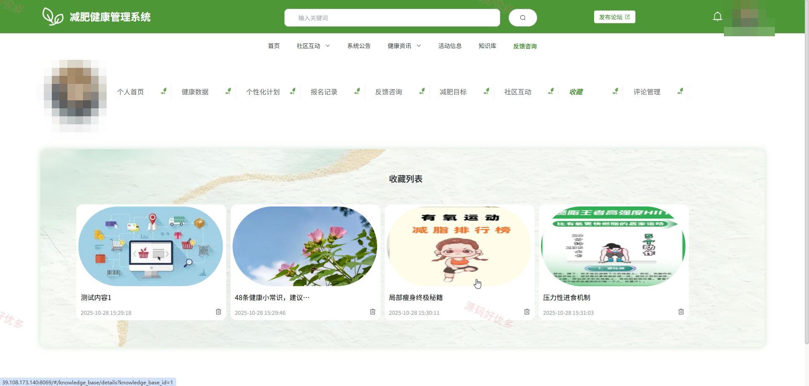
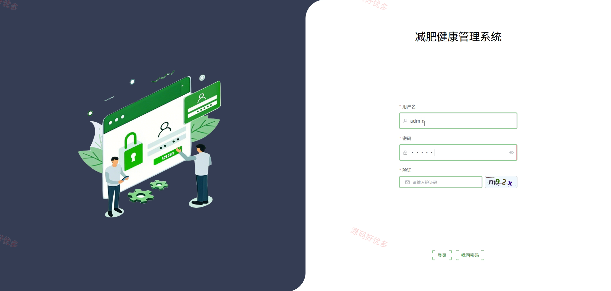
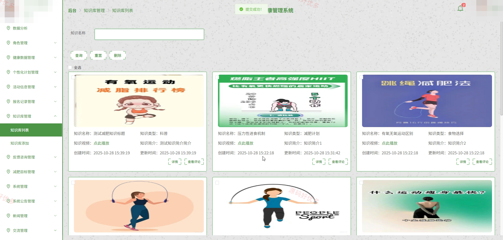
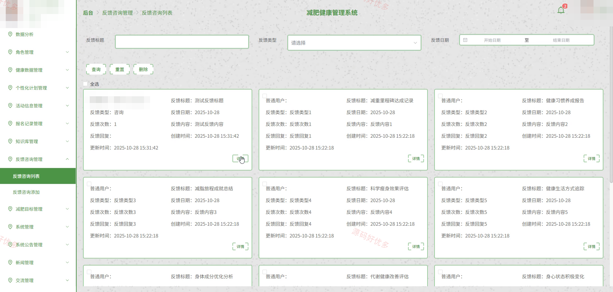
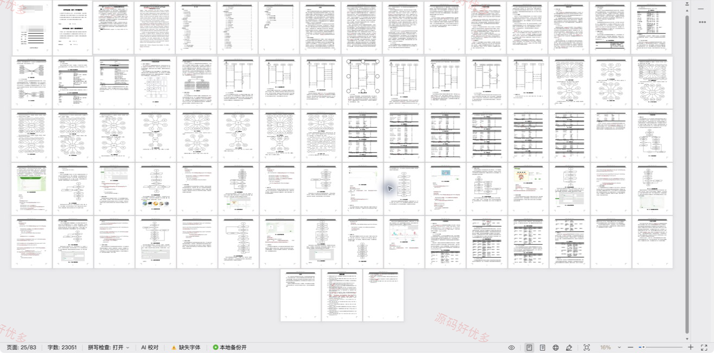

# springbootA610D
springbootA610D健康减肥管理系统
## 源码问题查看主页咨询

### 一、关键词
健康减肥管理系统、健康减肥、健康减肥信息管理、健康减肥后台管理

### 二、作品包含
源码+数据库+万字设计文档+PPT+全套环境和工具资源+本地部署教程

### 三、项目技术
前端技术： Html、Css、Js、Vue3.4、Element-Plus
后端技术：Java、SpringBoot3.0.0、MyBatis-Plus

### 四、运行环境（以下版本亲测，其他版本兼容性请自行测试）
开发工具：IDEA/eclipse + VSCODE

数据库：MySQL8.0+（共28张表）

数据库管理工具：Navicat10以上版本

环境配置软件： JDK1.8 + Maven3.6.3

前端Nodejs：16+

浏览器：谷歌浏览器

### 五、项目介绍
项目编号：springbootA610D

健康减肥管理系统面向管理员、普通用户，提供项目核心业务等功能，实现各角色在系统中的实际业务协作。

角色：管理员、普通用户

管理员功能：普通用户信息管理、健康数据维护、个性化计划管理、活动与报名管理、健康知识与资讯管理、减肥目标管理、反馈咨询处理、社区互动管理。

普通用户功能：个人资料与减肥目标管理、健康数据记录与查看、个性化计划查看、活动浏览与报名、健康知识与资讯浏览、反馈咨询提交与查看、社区互动评论收藏、公告查看。

### 六、运行截图

